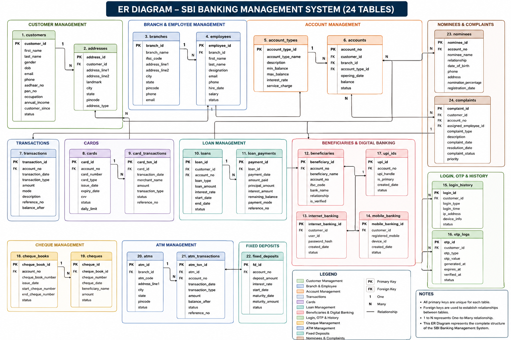

# Banking Analytics Dashboard

## Overview
An interactive Power BI dashboard built using PostgreSQL and Excel to analyze customer portfolios, account balances, and loan performance for a simulated Indian banking dataset.

## Tools Used
- Power BI
- PostgreSQL
- Excel
- SQL
- DAX

## Dataset
- 200 Customers
- 300 Accounts
- 5000 Transactions
- Loans
- Branches
- Employees
- Cards
- UPI
- Internet Banking

## Dashboard 1 – Customer & Balance Overview
### KPIs
- Active Customers
- Total Balance
- Average Balance
- Dormant Accounts

### Visuals
- Customer Distribution by Occupation
- Customer Distribution by State
- Branch-wise Balance Treemap
- Balance Trend by Year

### Key Insights
- Maharashtra has the highest customer concentration.
- Teachers form the largest customer segment.
- Surat and Gurugram branches hold the highest balances.
- Dormant accounts represent around 22% of the portfolio.

## Dashboard 2 – Loan Portfolio Analysis
### KPIs
- Total Loan Amount
- Outstanding Amount
- Active Loans
- Defaulted Loans

### Visuals
- Loan Status Distribution
- Loan Type Distribution
- Outstanding Amount by Loan Type
- Loan Revenue Trend

### Key Insights
- Home loans account for the largest share of the portfolio.
- Personal, Education, and Gold loans contribute moderate exposure.
- Revenue fluctuates across years.
- Loan portfolio composition highlights areas for risk monitoring.

## Database Schema

The dashboard is built on a normalized PostgreSQL database consisting of multiple banking entities such as customers, accounts, transactions, loans, branches, cards, and digital banking services.

### ER Diagram

